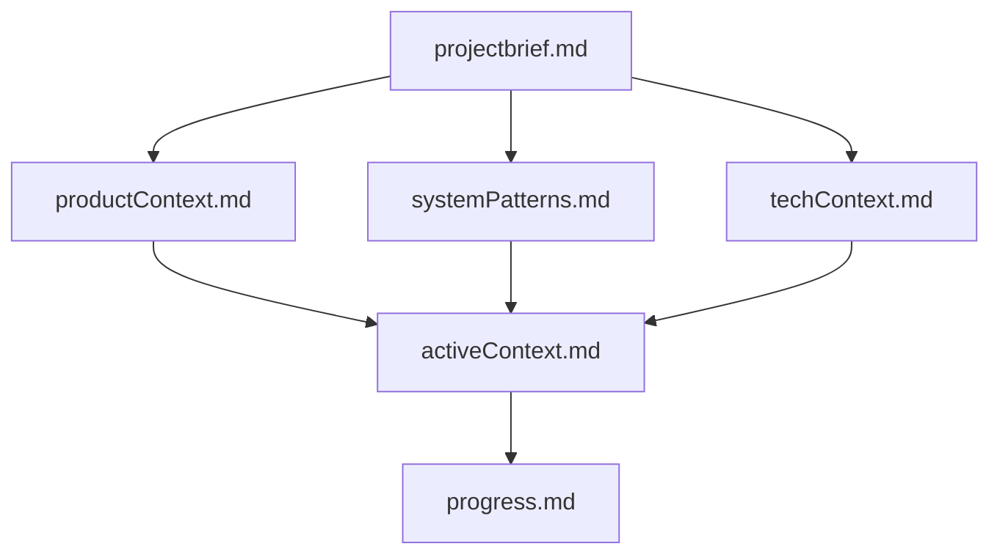

# Memory Bank: 4th Tale Inc Website

## Overview
This Memory Bank serves as the complete knowledge base for the 4th Tale Inc website project. It ensures project continuity between sessions by maintaining comprehensive documentation of all aspects of the project.

## Structure

### Core Files (Required)
1. **`projectbrief.md`** - Foundation document defining project scope, requirements, and goals
2. **`productContext.md`** - Business context, user needs, and value proposition
3. **`systemPatterns.md`** - Technical architecture, design patterns, and component relationships
4. **`techContext.md`** - Technology stack, development setup, and constraints
5. **`activeContext.md`** - Current work focus, recent changes, and next priorities
6. **`progress.md`** - Feature completion status, known issues, and development roadmap

### File Relationships

## Usage Guidelines

### For New Sessions
1. **Always read ALL Memory Bank files** before starting work
2. Begin with `projectbrief.md` to understand project foundation
3. Review `activeContext.md` for current priorities
4. Check `progress.md` for latest status

### For Updates
- **Major Changes**: Update relevant files immediately
- **Active Work**: Keep `activeContext.md` current
- **Completion**: Update `progress.md` with completed features
- **Architecture Changes**: Document in `systemPatterns.md`

### When to Update
- After implementing significant features
- When project direction changes
- When new patterns are established
- When user provides feedback or corrections

## Project Status
- **Type**: Creative agency portfolio website
- **Technology**: React + Vite with advanced animations
- **Stage**: Functional MVP with enhancement opportunities
- **Focus**: High-quality user experience and performance

## Key Project Characteristics
- **Animation-Heavy**: Extensive GSAP and Framer Motion usage
- **Performance-Critical**: 60fps animations across devices
- **Content-Rich**: Portfolio, team, and case study content
- **Mobile-First**: Responsive design with mobile optimization
- **Professional**: High-end creative agency presentation

## Quick Reference
- **Main Components**: Home, Work, NavBar, VideoPlayer, Cursor
- **Animation Libraries**: GSAP, Framer Motion, React Lenis
- **Asset Categories**: Projects, Team, Work samples, Video
- **Development**: `npm run dev` for local development
- **Build**: `npm run build` for production

## Memory Bank Maintenance
This Memory Bank is maintained through automated processes and should be updated whenever:
- Project scope changes
- New features are implemented
- Technical architecture evolves
- User requirements shift
- Performance issues are identified

The Memory Bank ensures that every session begins with complete project context, enabling efficient and informed development decisions. 